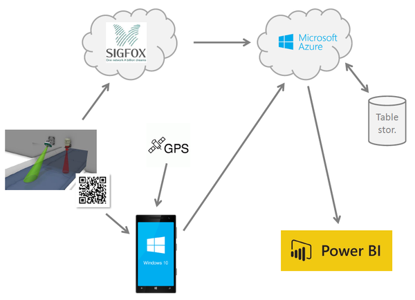

# Flood Fox #

*System for monitoring water level of small rivers. System aggregates current values and keep an eye on possible flood situation.*

## Intro ##

This project was created during Microsoft **CEE IoT Hackathon Czech Republic**

## Used technology ##

- Hardware ([photo](https://raw.githubusercontent.com/ah01/FloodFox/master/prezentace/images/FullSizeRender.jpg))
	- Ultrasonic Range detector (to measure water level)
	- Arduino Uno
	- SigFox module TD1207 (modem for SigFox network)
- Backend
	- SigFox backend with Azure IoT Hub integration
	- Azure IoT Hub
	- Azure Stream Analytics
	- Azure Table storage
	- Microsoft Power BI
- Mobile application for technician (support during installation of device)
	- Universal App for Windows 10

## Content of repository ##

- *azure* - Azure configuration
- *doc* - little bit of documentation
- *hw* - FW for Arduino (prototype)
- *mobile* - Universal app for install technician
- *prezentace* - Final presentation (czech only, sorry)
- *sigfox* - notes about sigfox backend settings

## Team ##

- Adam Hořčica (HW, overall idea)
- Jiří Koutný (Azure)
- Petr Fuk (Power BI)
- Zbyněk Sulc (Mobile app)

Petr Vacha (R&D)